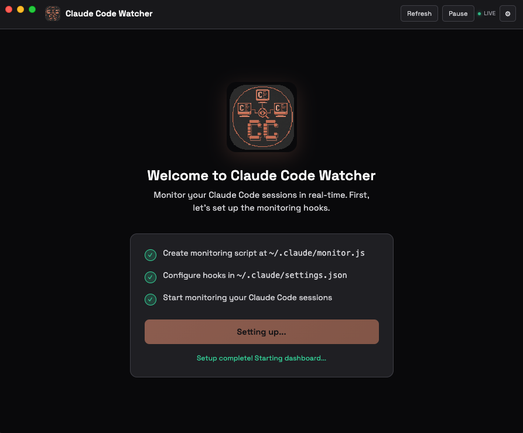
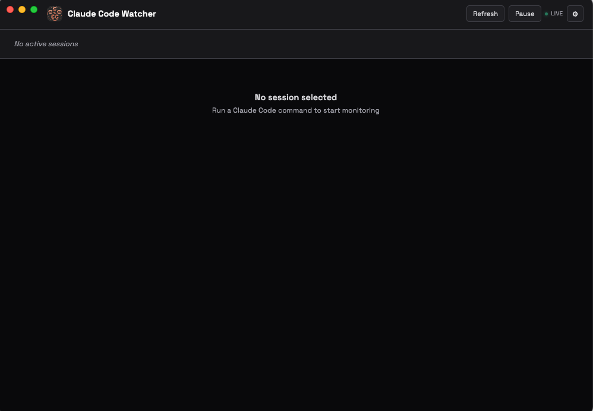

# Claude Code Watcher

> A native macOS app for real-time monitoring of Claude Code sessions.

[](https://opensource.org/licenses/MIT)

## Quick Start

```bash
git clone https://github.com/onorbumbum/claude-code-watcher.git
cd claude-code-watcher
npm install
npm start
```

On first launch, click "Setup Monitoring" to install the hooks. Then run any Claude Code command to see it appear in the dashboard.

### macOS Gatekeeper Notice

If you build and install the app to `/Applications`, macOS may block it with "app is damaged" or "unidentified developer" warnings. This is because the app isn't notarized with Apple.

**Fix it with one command:**
```bash
xattr -cr "/Applications/Claude Code Watcher.app"
```

Or: Right-click the app → Open → Click "Open" in the dialog.

## Screenshots

| Setup | Dashboard |
|-------|-----------|
|  |  |

*Left: First-run setup automatically installs monitoring hooks. Right: Dashboard ready to monitor sessions.*

## Why This Exists

**Problem:** When running Claude Code in headless mode (via n8n automation or CLI), there's no visibility into what Claude is doing - no way to see its thinking, tool calls, or responses in real-time.

**Solution:** This Electron app reads Claude Code's transcript files directly from disk and displays them in a live-updating dashboard. No server required.

## Architecture

```
┌─────────────────────────────────────────────────────────────────┐
│                         Claude Code                              │
│  (running headless via n8n, CLI, or any automation)             │
└─────────────────────┬───────────────────────────────────────────┘
                      │ writes
                      ▼
┌─────────────────────────────────────────────────────────────────┐
│                    ~/.claude/                                    │
│  ├── projects/[project]/[session-id].jsonl  ← transcripts       │
│  ├── active-sessions.json                   ← session registry  │
│  ├── settings.json                          ← hooks config      │
│  └── monitor.js                             ← hook script       │
└─────────────────────┬───────────────────────────────────────────┘
                      │ reads (via Node.js fs)
                      ▼
┌─────────────────────────────────────────────────────────────────┐
│                   Claude Code Watcher.app                        │
│  ├── main.js      ← Electron main process, IPC handlers         │
│  └── index.html   ← Dashboard UI, polls via IPC                 │
└─────────────────────────────────────────────────────────────────┘
```

## How It Works

### 1. Session Tracking (Hooks)

Claude Code hooks in `~/.claude/settings.json` trigger `monitor.js` on every tool call:

```json
{
  "hooks": {
    "PreToolUse": [{ "matcher": "*", "hooks": [{ "type": "command", "command": "node \"$HOME/.claude/monitor.js\" pre_tool" }] }],
    "PostToolUse": [{ "matcher": "*", "hooks": [{ "type": "command", "command": "node \"$HOME/.claude/monitor.js\" post_tool" }] }],
    "Stop": [{ "matcher": "*", "hooks": [{ "type": "command", "command": "node \"$HOME/.claude/monitor.js\" stop" }] }]
  }
}
```

### 2. Session Registry

`monitor.js` maintains `~/.claude/active-sessions.json`:

```json
[
  {
    "id": "abc123-...",
    "path": "/Users/.../.claude/projects/.../abc123.jsonl",
    "name": "project-folder-name",
    "lastSeen": 1705234567
  }
]
```

Sessions expire after 5 minutes of inactivity (cleaned up when new sessions run).

### 3. Transcript Format

Each line in a transcript `.jsonl` file is a JSON object:

```json
{"type": "assistant", "message": {"content": [{"type": "text", "text": "..."}]}, "timestamp": "..."}
{"type": "assistant", "message": {"content": [{"type": "tool_use", "name": "Bash", "input": {...}}]}, ...}
{"type": "user", "message": {"content": [{"type": "tool_result", "content": "..."}]}, ...}
```

Content can be:
- `type: "text"` - Claude's response text
- `type: "thinking"` - Claude's reasoning (extended thinking)
- `type: "tool_use"` - Tool call with name and input
- `type: "tool_result"` - Result from tool execution

### 4. Dashboard Polling

The Electron app:
1. Polls `active-sessions.json` every 5 seconds
2. Polls each session's transcript every 2 seconds
3. Renders messages with newest first
4. Shows tabs for multiple concurrent sessions

## Features

- **Setup Screen**: First-run experience that automatically installs monitoring hooks
- **Settings Menu**: Install/uninstall hooks, switch themes
- **Dark/Light Theme**: Toggle between themes via settings dropdown
- **Multi-Session Tabs**: Monitor multiple concurrent Claude Code sessions
- **Live Updates**: Real-time polling with pause/resume controls

## File Structure

```
~/.claude-monitor/
├── package.json        # App config, build scripts
├── main.js             # Electron main process
│                       # - Creates BrowserWindow with secure config
│                       # - IPC handlers: check-setup, run-setup, run-uninstall,
│                       #   read-sessions, read-transcript
│                       # - Embedded monitor.js script content
├── preload.js          # Secure context bridge for IPC
├── index.html          # Dashboard UI (single file, ~900 lines)
│                       # - Styles (CSS variables, dark/light themes)
│                       # - Setup screen for first-run
│                       # - Settings dropdown (hooks, theme)
│                       # - Rendering functions (messages, tools, tabs)
│                       # - Polling logic (fetchSessions, fetchTranscript)
├── logo.png            # App icon (PNG)
├── icon.icns           # macOS app icon
├── screenshot-1.png    # Setup screen screenshot
├── screenshot-2.png    # Dashboard screenshot
├── LICENSE             # MIT license
├── CONTRIBUTING.md     # Contribution guidelines
├── CODE_OF_CONDUCT.md  # Community guidelines
├── CHANGELOG.md        # Version history
├── dist/               # Built app output (git-ignored)
│   └── mac-arm64/
│       └── Claude Code Watcher.app
└── README.md           # This file

~/.claude/
├── settings.json       # Claude Code config with hooks
├── monitor.js          # Hook script that updates session registry (Node.js)
├── active-sessions.json # Registry of active sessions
├── events.jsonl        # Raw hook events (backup/debug)
├── current-transcript.txt # Path to most recent session
└── projects/
    └── [project-path]/
        └── [session-id].jsonl  # Full conversation transcript
```

## Development

### Run in Development
```bash
cd ~/.claude-monitor
npm start
```

### Build macOS App
```bash
npm run build:dir
# Output: dist/mac-arm64/Claude Code Watcher.app
```

### Install to Applications
```bash
cp -R dist/mac-arm64/"Claude Code Watcher.app" /Applications/
```

## Key Implementation Details

### IPC Communication

The renderer (index.html) cannot access the filesystem directly. It uses a secure preload script:

```javascript
// preload.js - exposes safe API via contextBridge
contextBridge.exposeInMainWorld('api', {
  readSessions: () => ipcRenderer.invoke('read-sessions'),
  // ...
});

// Renderer (index.html) - uses the exposed API
const data = await api.readSessions();

// Main process (main.js) - handles the request
ipcMain.handle('read-sessions', async () => {
  return fs.readFileSync(path.join(CLAUDE_DIR, 'active-sessions.json'), 'utf8');
});
```

Available IPC handlers:
- `check-setup` - Returns setup status (hooks configured, script exists)
- `run-setup` - Installs monitor.js and configures hooks
- `run-uninstall` - Removes hooks and monitor script
- `read-sessions` - Returns active sessions JSON
- `read-transcript` - Returns transcript file content

### Content Format Handling

Transcript messages have `message.content` as either:
- A string (legacy format)
- An array of blocks (modern format)

The dashboard handles both:
```javascript
let content = msg.message?.content;
if (typeof content === 'string') content = [{ type: 'text', text: content }];
else if (!Array.isArray(content)) content = [];
```

### Session Expiry

Sessions are cleaned from `active-sessions.json` when:
1. A new hook event fires (Node.js filters out sessions older than 5 min)
2. The dashboard ignores sessions not in the registry

No cron job needed - cleanup happens organically.

### Automatic Hook Installation

On first launch, the app shows a setup screen that:
1. Creates `~/.claude/monitor.js` (embedded in main.js)
2. Merges monitoring hooks into `~/.claude/settings.json`
3. Preserves any existing hooks/settings

Hooks can be installed/uninstalled anytime via the settings menu.

## Troubleshooting

### No sessions appearing
1. Check `~/.claude/active-sessions.json` exists and has content
2. Verify hooks are configured in `~/.claude/settings.json`
3. Run a Claude Code command to trigger hooks

### App shows empty messages
1. Check the transcript file exists at the path shown
2. Verify transcript has `type: "user"` or `type: "assistant"` entries
3. Check browser console (Cmd+Option+I) for errors

### Hooks not firing
1. Verify `~/.claude/monitor.js` exists
2. Test hook manually: `echo '{"session_id":"test"}' | node ~/.claude/monitor.js pre_tool`
3. Check `~/.claude/events.jsonl` for logged events
4. Re-install hooks via Settings menu

## Future Improvements

Potential enhancements (not implemented):
- [ ] Search/filter messages
- [ ] Export session to markdown
- [ ] Token usage display
- [ ] Cost tracking
- [ ] Notification when session completes

## Dependencies

- **Electron 28.x** - Cross-platform desktop app framework
- **electron-builder** - Packaging for macOS .app
- **Node.js fs** - Reading transcript files

Note: No external dependencies like `jq` required - the monitor script is pure Node.js.

## Context for AI Agents

When working on this codebase:

1. **The app reads files, never writes them** - It's a passive monitor (except for setup)
2. **Hooks are the source of truth** - If sessions aren't appearing, check hooks first
3. **Transcript format varies** - Always handle both string and array content
4. **No server needed** - Electron's Node.js integration reads files directly
5. **Session registry is ephemeral** - It's rebuilt from hook events, not persisted long-term
6. **UI is single-file** - All styles, scripts, and markup in index.html for simplicity
7. **Setup is automatic** - The app installs its own hooks on first run
8. **Settings menu** - Provides install/uninstall hooks and theme toggle

The design prioritizes KISS:
- Single HTML file for the entire UI
- No build step for the frontend (no React, no bundler)
- No database (just JSON files)
- No server (Electron reads filesystem directly)
- No external dependencies for the hook script (pure Node.js)

## Contributing

Contributions are welcome! Please read [CONTRIBUTING.md](CONTRIBUTING.md) for guidelines.

## License

This project is licensed under the MIT License - see the [LICENSE](LICENSE) file for details.
